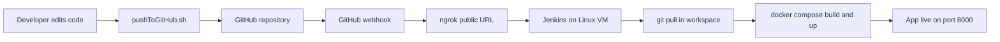

# RecoSys — Unix DevOps Final Project

A keyword-based recommendation web application deployed with **Docker** and automated through **Git**, a **Bash push script**, and **Jenkins CI/CD** with **GitHub webhooks** (via **ngrok**).

## Overview

Users enter a keyword (e.g. `hot`, `tired`, `bored`) and receive a recommendation from a MySQL database. The stack runs in Docker containers on a Linux VM and redeploys automatically when changes are pushed to GitHub.

## Tech Stack

| Layer | Technology |
|-------|------------|
| Frontend | HTML, CSS, JavaScript |
| Backend | PHP (Apache) |
| Database | MySQL |
| DB Admin | phpMyAdmin |
| Containers | Docker, Docker Compose |
| Version control | Git, GitHub |
| Automation | Bash (`pushToGitHub.sh`) |
| CI/CD | Jenkins (Pipeline in UI), GitHub webhook, ngrok |

## Project Structure

```
Unix-Devops-project/
├── website/                 # Web application
│   ├── index.html
│   ├── style.css
│   ├── script.js
│   └── recommend.php        # API — queries MySQL
├── recommendations.sql      # DB schema + seed data
├── Dockerfile               # Apache + PHP image for www service
├── docker-compose.yml       # www, db, phpmyadmin services
├── pushToGitHub.sh          # Bash script — automate git push
├── .env                     # MySQL root password (local / VM only)
└── README.md
```

## System Workflow

End-to-end flow used for development and deployment:



### Step-by-step

1. **Develop** — Edit files under `website/` (or other project files) on a developer machine or via SSH (VS Code).
2. **Push** — Run `pushToGitHub.sh` to commit and push changes to the `main` branch on GitHub.
3. **Webhook** — GitHub sends a POST request to the Jenkins webhook URL (public URL provided by **ngrok** tunneling to Jenkins on port `8080`).
4. **Jenkins** — The Pipeline job runs:
   - **Pull Code** — Clone/fetch the latest `main` from GitHub.
   - **Deploy with Docker** — `docker compose down` then `docker compose up -d --build`.
5. **Access** — Open the website at `http://<VM-IP>:8000` (or a forwarded port via SSH).

> **Note:** Jenkins and ngrok must be running on the deployment VM for automatic builds. Anyone with push access can trigger a deploy; the server must be online.

## Local Setup (Linux VM)

### Prerequisites

- Linux VM with Docker and Docker Compose installed
- Git
- (Optional) Jenkins + ngrok for CI/CD

### 1. Clone the repository

```bash
git clone https://github.com/ibraheemIsleem/Unix-Devops-project.git
cd Unix-Devops-project
```

### 2. Environment file

Create or copy `.env` in the project root:

```env
MYSQL_ROOT_PASSWORD=your_password_here
```

Ensure `recommend.php` uses the same password for the database connection, or update both to match.

### 3. Start the application

```bash
docker compose up -d --build
```

### 4. Verify

| Service | URL |
|---------|-----|
| Website | http://localhost:8000 |
| API test | http://localhost:8000/recommend.php?q=hot |
| phpMyAdmin | http://localhost:8081 |

Example API response:

```json
{
  "results": [
    {
      "recommendation": "Summer",
      "keyword": "hot",
      "category": "General"
    }
  ]
}
```

### 5. Stop the stack

```bash
docker compose down
```

## Push Script (`pushToGitHub.sh`)

Automates initializing a repo (if needed), connecting a remote, pulling, committing, and pushing to GitHub.

### Usage

```bash
chmod +x pushToGitHub.sh
./pushToGitHub.sh <folder_path> <commit_message> <file_to_add> <branch_name>
```

### Example

```bash
./pushToGitHub.sh /home/user/Unix-Devops-project "Update homepage" website/index.html main
```

### Behavior

- Initializes a local Git repo if `.git` does not exist
- Prompts for remote URL, username, and email on first run
- Checks out the target branch (creates it if missing)
- Pulls latest changes from remote before committing
- Stages **one file** per run (path relative to the project folder)
- Exits if merge conflicts occur or if there are no changes to commit

> **Tip:** Run the script from the VM or any machine that has Git credentials (SSH key or GitHub token) configured for `git push`.

## Jenkins CI/CD Setup

Pipeline is configured in the **Jenkins UI** (not stored in the repository).

### Infrastructure on the deployment VM

1. **Jenkins** — Runs on port `8080` (typically as a Docker container with access to the host Docker socket).
2. **ngrok** — Exposes Jenkins to the internet, e.g. `ngrok http 8080`.
3. **GitHub webhook** — Payload URL: `https://<ngrok-id>.ngrok-free.app/github-webhook/`, event: push.

### Pipeline stages (Groovy in Jenkins UI)

```groovy
pipeline {
    agent any
    stages {
        stage('Pull Code') {
            steps {
                git branch: 'main',
                    credentialsId: 'github-cred',
                    url: 'https://github.com/ibraheemIsleem/Unix-Devops-project.git'
            }
        }
        stage('Deploy with Docker') {
            steps {
                sh 'docker compose down'
                sh 'docker compose up -d --build'
            }
        }
    }
}
```

### Jenkins job checklist

- [ ] GitHub hook trigger enabled on the job
- [ ] Credential `github-cred` created (for private repos)
- [ ] Jenkins can run `docker` and `docker compose` (Docker socket mounted if Jenkins runs in Docker)
- [ ] ngrok running and webhook URL updated when the ngrok URL changes

## Sample Keywords

| Keyword | Recommendation |
|---------|----------------|
| hot | Summer |
| cold | Winter |
| hungry | Shawarma |
| tired | Sleep |
| bored | Play Minecraft |

Use the site search or open the full catalog from the UI.

## Future Improvements

- Add `cd "$WORKSPACE"` in deploy shell steps for clarity
- Post-deploy health check (`curl` against `recommend.php?q=hot`)
- Store `github-cred` in Jenkins and remove hardcoded DB password from `recommend.php`
- Add `.env` to `.gitignore` and commit `.env.example` instead
- Copy `website/` into the Dockerfile for image-only deploys (without bind mounts)
- Poll SCM as a backup trigger if ngrok is offline
- Expand `pushToGitHub.sh` to support staging all changed files

## Team

- Repository: [ibraheemIsleem/Unix-Devops-project](https://github.com/ibraheemIsleem/Unix-Devops-project)
- Course: Unix — Final DevOps Project